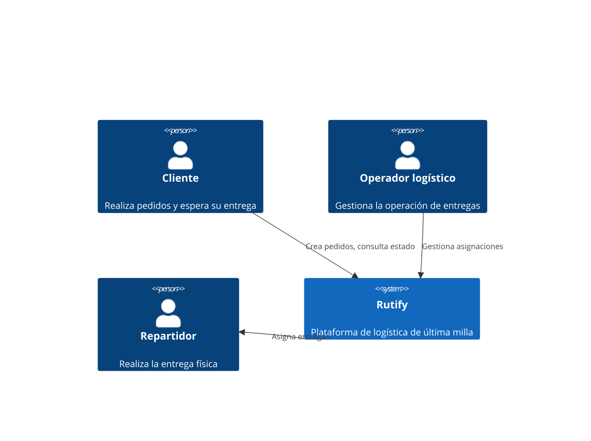
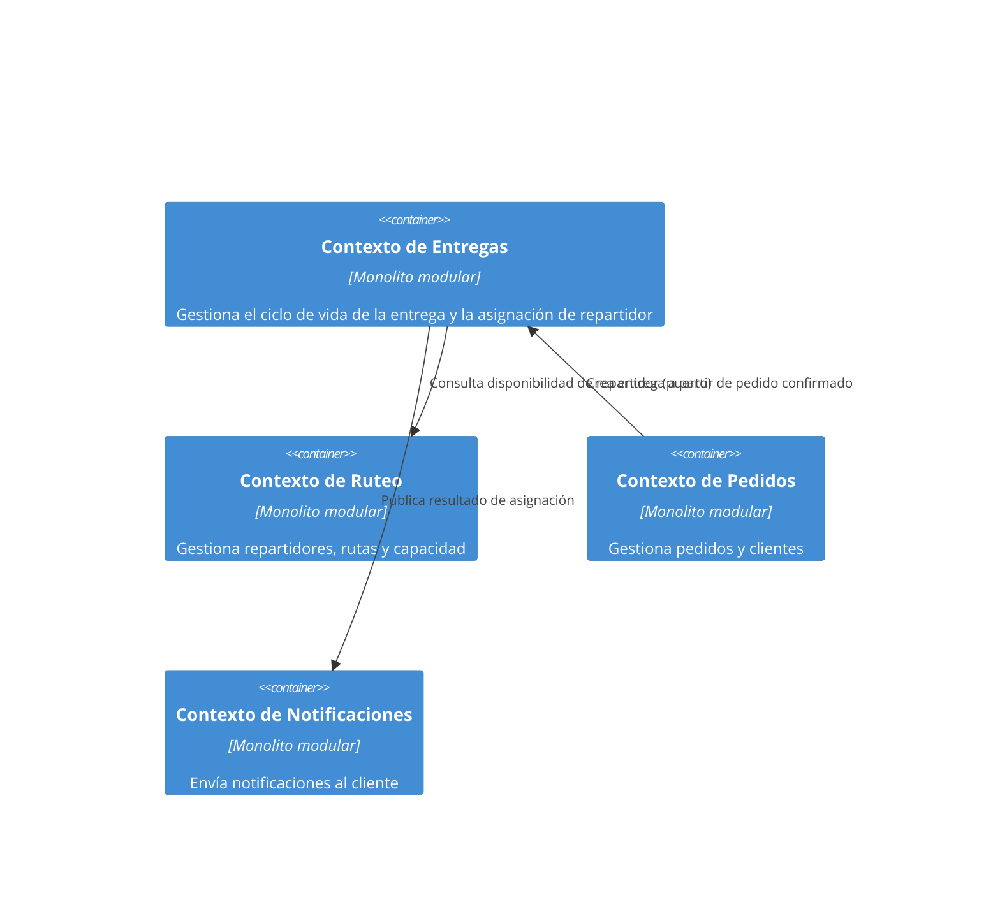
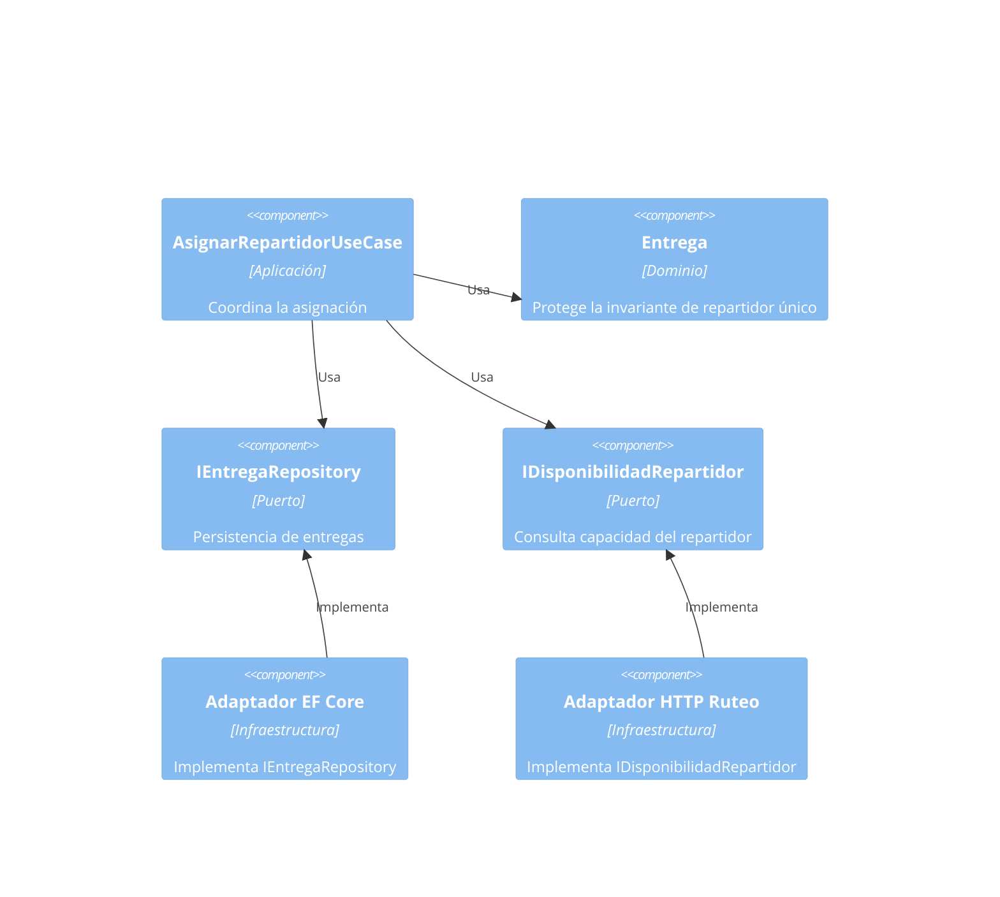

# Diagrama C4 — Flujo de asignación de repartidor

## Nivel 1 — Contexto

```mermaid
C4Context
    Person(cliente, "Cliente", "Realiza pedidos y espera su entrega")
    Person(operador, "Operador logístico", "Gestiona la operación de entregas")
    Person(repartidor, "Repartidor", "Realiza la entrega física")

    System(rutify, "Rutify", "Plataforma de logística de última milla")

    Rel(cliente, rutify, "Crea pedidos, consulta estado")
    Rel(operador, rutify, "Gestiona asignaciones")
    Rel(rutify, repartidor, "Asigna entregas")
```

## Nivel 2 — Contenedores (dentro de Rutify)

```mermaid
C4Container
    Container(entregas, "Contexto de Entregas", "Monolito modular", "Gestiona el ciclo de vida de la entrega y la asignación de repartidor")
    Container(ruteo, "Contexto de Ruteo", "Monolito modular", "Gestiona repartidores, rutas y capacidad")
    Container(pedidos, "Contexto de Pedidos", "Monolito modular", "Gestiona pedidos y clientes")
    Container(notificaciones, "Contexto de Notificaciones", "Monolito modular", "Envía notificaciones al cliente")

    Rel(pedidos, entregas, "Crea entrega a partir de pedido confirmado")
    Rel(entregas, ruteo, "Consulta disponibilidad de repartidor (puerto)")
    Rel(entregas, notificaciones, "Publica resultado de asignación")
```

## Nivel 3 — Componentes (dentro del Contexto de Entregas)

```mermaid
C4Component
    Component(usecase, "AsignarRepartidorUseCase", "Aplicación", "Coordina la asignación")
    Component(entidad, "Entrega", "Dominio", "Protege la invariante de repartidor único")
    Component(repo, "IEntregaRepository", "Puerto", "Persistencia de entregas")
    Component(disp, "IDisponibilidadRepartidor", "Puerto", "Consulta capacidad del repartidor")
    Component(adapterDb, "Adaptador EF Core", "Infraestructura", "Implementa IEntregaRepository")
    Component(adapterRuteo, "Adaptador HTTP Ruteo", "Infraestructura", "Implementa IDisponibilidadRepartidor")

    Rel(usecase, entidad, "Usa")
    Rel(usecase, repo, "Usa")
    Rel(usecase, disp, "Usa")
    Rel(adapterDb, repo, "Implementa")
    Rel(adapterRuteo, disp, "Implementa")
```
